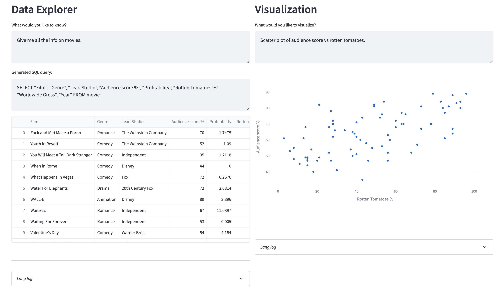

# langchain-eda
Exploratory data analysis via natural language.

## Contents

- `sql_query_chain` - based on default langchain prompts for generating sql
- `plotly_express_chain` - uses [marvin](https://github.com/PrefectHQ/marvin) for keyword argument parsing

## Installation

1. Install `make install`
2. Run tests `make test`
3. Run app `make run`
